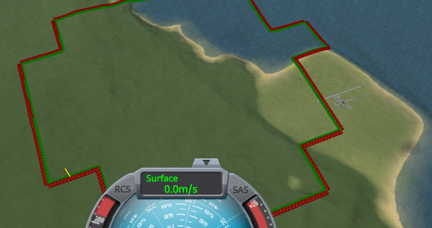

# KSP Diag - Quad Seams

**⚠️ Work in progress.** This is an active investigation, not a finished mod. The code and this page can still change, and several questions are still open.

A viewing instrument for KSP 1.12. In flight, it draws over the terrain the seam where the quads of the
highest subdivision level meet coarser quads: the triangles each of the two quads has along the edge
they share, green for the finer quad, red for the coarser one, and a yellow line where the two are
furthest apart. The drawing shows through the hills, so the whole seam can be followed from far away.
It also writes to the log how far apart the two quads put the vertices they share.

What goes wrong along that seam, and why, is explained by
[Terrain Precision Fix](https://github.com/lhervier/KSP-TerrainPrecisionFix), in
[The seam between subdivision levels](https://github.com/lhervier/KSP-TerrainPrecisionFix/blob/master/docs/non-regression/the-seam-between-subdivision-levels.md).
This mod only shows it.

**How this was made.** Written with Claude, Anthropic's AI assistant, and reviewed line by line by a
human — me. I am saying so up front, because contributions made with an AI deserve a closer look than
others, and because some people would rather stop reading here. That look is easy to give here: this
mod changes nothing in the game, it only reads the vertices and triangles the game already holds for
each quad, and the source is a few hundred lines with no dependency of any kind.

## What it shows

Around the active craft, the terrain is made of quads of the highest level; further away, of coarser
ones. Where the two meet, the finer quad leaves out every other vertex of its edge, and the ones it
keeps should land on the vertices of the coarser edge. The mod draws the triangles of both quads along
that seam, marks with a yellow line the shared vertex where they are furthest apart, and logs the gaps:
their mean, the largest one, and how much of it is a step up or down and how much a gap beside. The
buttons of a small window switch between the whole drawing, the yellow line alone, and nothing.

*Stock KSP 1.12.5 with KSP Community Fixes: a capsule landed a few kilometres from the Space Center,
the camera pulled back 10 km from it.*

**→ Full chapter: [What it shows](docs/what-it-shows.md)**

## The protocol

Two cases, the same steps each time: Real Solar System, then stock KSP. A craft on the launchpad is
reverted to launch until the log says the finer quad is above the coarser one at the largest gap, the
way round a crack shows best from beyond the seam; the camera is
then pulled back just past the yellow line, looking back towards the craft, and two screenshots are
taken without moving the camera: one with the yellow line only, one with the triangles, to tell
whether a dark line runs along the seam. A script plays it through KSP-MCPServer.

**→ Full chapter: [The protocol](docs/the-protocol.md)**

## The measurements

A craft on the launchpad, reverted by the script: the largest gap of a load went from 0.76 m to 2.82 m
on Earth under Real Solar System, over 79 loads, and from 118 mm to 312 mm on Kerbin, over seven. The
crack shows on both, but on Earth only one load of the 79 showed it clearly.

**→ Full chapter: [The measurements](docs/the-measurements.md)**

## What the measurements show

The seam is open: the vertices its two quads are supposed to share are apart, by metres on Earth and
by centimetres on Kerbin, by an amount and in a direction that change from one load to the next. It can
be seen as a crack on both, though it takes looking for. Where to look from matters as much as the size
of the gap.

**→ Full chapter: [What the measurements show](docs/what-the-measurements-show.md)**

## Get it

Either way you end up with the same `GameData/KSPDiagQuadSeams/` folder.

**Download it** — from the assets of the
[latest release](https://github.com/lhervier/KSP-Diag-QuadSeams/releases/latest).

**Or compile it** — clone this repository, set `KSPDIR` to your KSP install folder and run
`build.bat`. It needs the .NET SDK, takes a few seconds, reads the KSP assemblies straight from your
install, and puts the DLL in `GameData/KSPDiagQuadSeams/` inside the repository. It does
not install anything. Worth doing if you would rather not run a binary you have no source for while
reporting a measurement.

## Install

Drop `GameData/KSPDiagQuadSeams` into the `GameData` of KSP, so that you end up with
`GameData/KSPDiagQuadSeams/KSPDiagQuadSeams.dll`. It runs on a stock install:
no Harmony, no ModuleManager, no dependency of any kind.

The drawing is there in every flight, the window's *nothing* hides it, and `Alt+F6` hides the window. The mod reads the terrain
and writes nothing but its lines in `KSP.log`; your saves are never touched. Removing the folder removes
the mod.

## License

MIT
