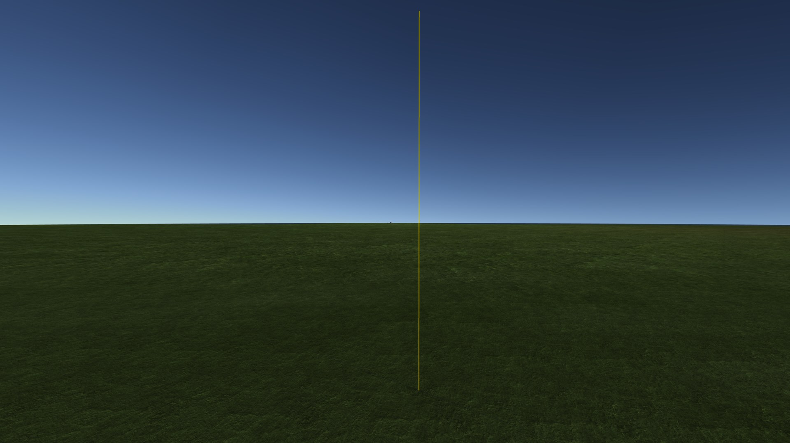
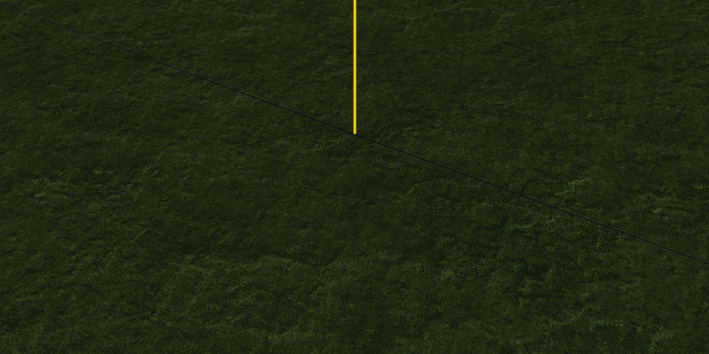
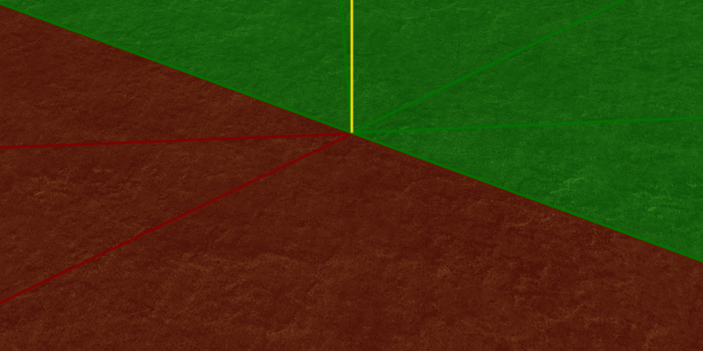
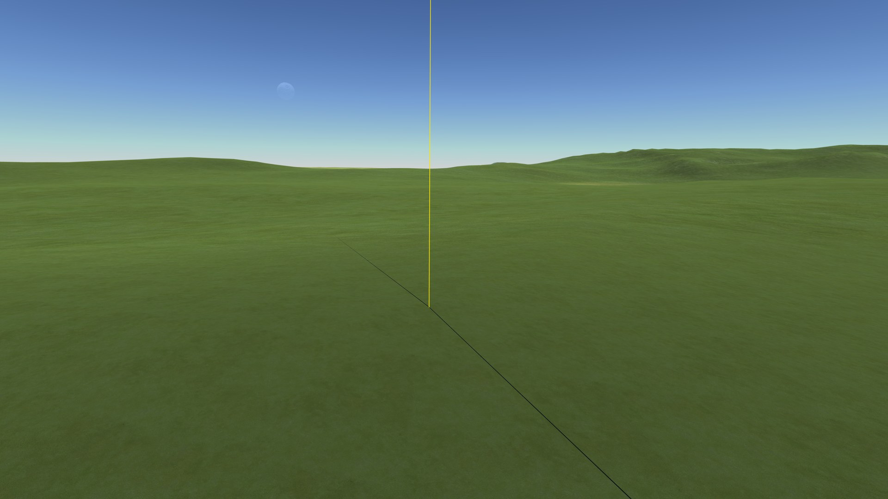
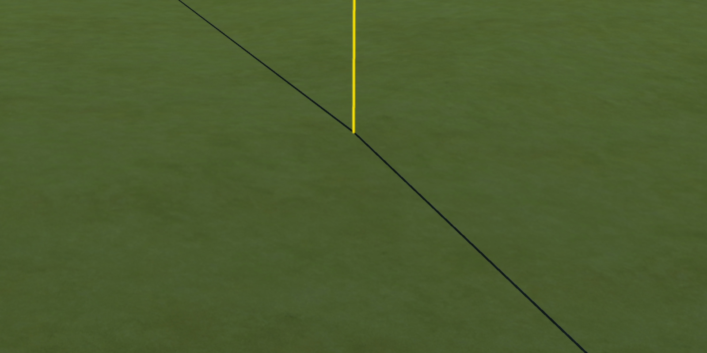
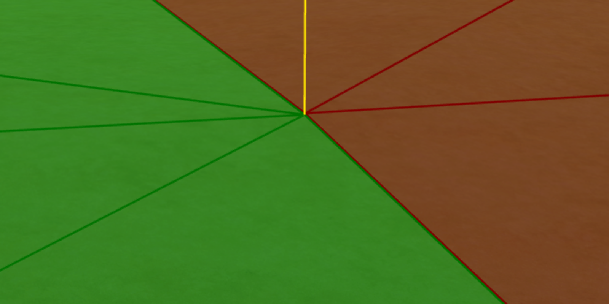

# The measurements

Part of [Terrain Precision Fix Diag 4](../README.md): the two cases of [the protocol](the-protocol.md),
as played so far.

## Case 1: Real Solar System

Real Solar System as released on KSP 1.12.5, with KSP Community Fixes; a craft on the launchpad at Cape
Canaveral, reverted to launch again and again, in two sessions, fifteen loads. On Earth the highest
level is 11, and every load ended with 60 seams between 49 quads of level 11 and 23 quads of level 10,
480 shared vertices. The loads were not stopped at the first "above": every one is listed. The log of
the first session was lost when the game was started again; its figures were read from it before that.
The logs, and those figures, are in [the runs](../diag/README.md).

The last line of the log after each load, in metres:

| Session | Load | Gap, mean | Gap, max | Finer quad at the largest gap | Beside | From the craft | Screenshot |
|---|---:|---:|---:|---|---:|---:|---|
| 1 | 1 | 1.55 | 2.40 | 2.07 below | 1.22 | 31.5 km | a faint crack along a seam |
| 1 | 2 | 2.14 | 3.05 | 2.67 below | 1.46 | 38.4 km | nothing |
| 1 | 3 | 0.34 | 1.10 | 0.90 above | 0.62 | 38.4 km | |
| 1 | 4 | 0.38 | 1.10 | 0.90 above | 0.64 | 32.0 km | nothing |
| 1 | 5 | 0.49 | 1.16 | 1.02 below | 0.57 | 40.3 km | |
| 1 | 6 | 0.66 | 1.40 | 1.22 above | 0.68 | 36.7 km | |
| 1 | 7 | 0.38 | 1.15 | 1.00 above | 0.56 | 41.7 km | |
| 1 | 8 | 0.44 | 1.23 | 1.08 below | 0.59 | 38.7 km | |
| 1 | 9 | 1.63 | 2.38 | 2.08 below | 1.15 | 40.4 km | nothing |
| 1 | 10 | 0.31 | 1.06 | 0.92 above | 0.53 | 41.6 km | nothing |
| 1 | 11 | 0.67 | 1.37 | 1.20 below | 0.68 | 35.5 km | nothing |
| 2 | 12 | 1.55 | 2.40 | 2.07 below | 1.22 | 31.5 km | |
| 2 | 13 | 1.25 | 1.96 | 1.72 below | 0.95 | 35.7 km | |
| 2 | 14 | 0.50 | 1.22 | 1.07 above | 0.60 | 38.8 km | |
| 2 | 15 | 0.36 | 1.01 | 0.82 above | 0.59 | 38.8 km | **a crack, along the seam** |

The first load of each session is the craft taken back from the Space Center after starting the game,
and both gave exactly the same figures.

The screenshots were taken with the camera beyond the seam, looking back towards the craft, at
7680 × 4320 (`SCREENSHOT_SUPERSIZE = 4`, on a 1920 × 1080 window).

**Load 15, the finer quad 0.82 m above**, two screenshots from the same camera: the yellow line only,
then everything.

*Case 1, load 15, the yellow line only. Click it for the full resolution. Below, the foot of the yellow
line, cut out of the full screenshot at its own size:*

*The same cut-out of the second screenshot, taken right after with the triangles drawn: the dark line
of the first one runs exactly along the edge between the red triangles of the coarser quad and the
green ones of the finer quad.*

**→ What it shows: [The seam is open](what-the-measurements-show.md#the-seam-is-open), and
[Where to look from](what-the-measurements-show.md#where-to-look-from)**

## Case 2: stock KSP

KSP 1.12.5 with KSP Community Fixes; a craft launched from the VAB onto the launchpad at the Space
Center, on Kerbin. On Kerbin the highest level is 10. One load, the launch itself, and the screenshots
came from it. The log is in [the runs](../diag/README.md).

| Load | Seams | Gap, mean | Gap, max | Finer quad at the largest gap | Beside | From the craft | Screenshot |
|---:|---:|---:|---:|---|---:|---:|---|
| 1 | 56 | 36.7 mm | 102.3 mm | 77.4 mm below | 66.9 mm | 6.5 km | **a crack, along the seam** |

The screenshots were taken with the camera beyond the seam, looking back towards the craft, at
7680 × 4320 (`SCREENSHOT_SUPERSIZE = 4`, on a 1920 × 1080 window): the yellow line only, then
everything, from the same camera.

*Case 2, load 1, the yellow line only. Click it for the full resolution. Below, the foot of the yellow
line, cut out of the full screenshot at its own size:*

*The same cut-out of the second screenshot, taken right after with the triangles drawn: the dark line
of the first one runs exactly along the edge between the green triangles of the finer quad and the red
ones of the coarser quad.*

**→ What it shows: [The seam is open](what-the-measurements-show.md#the-seam-is-open), and
[Where to look from](what-the-measurements-show.md#where-to-look-from)**
