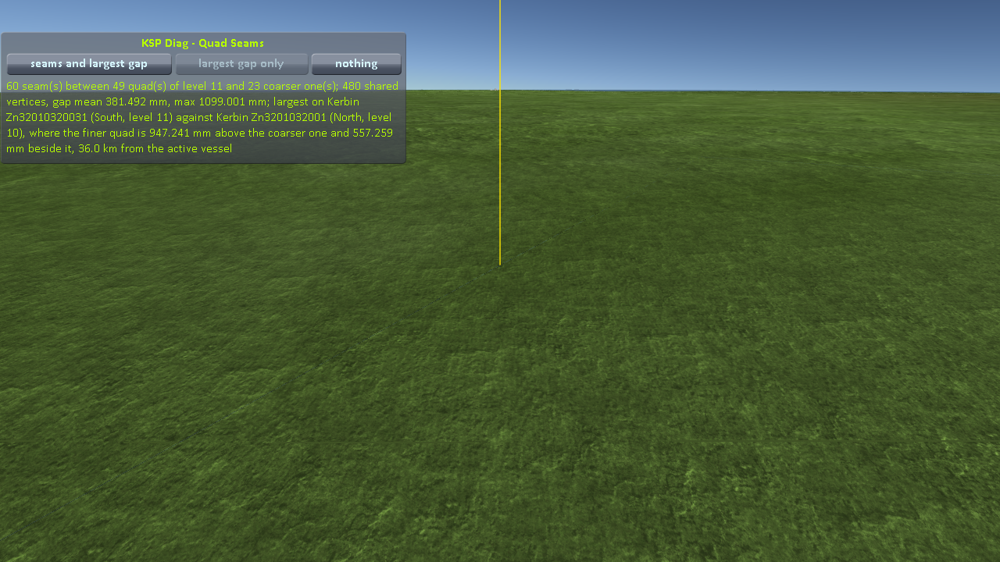
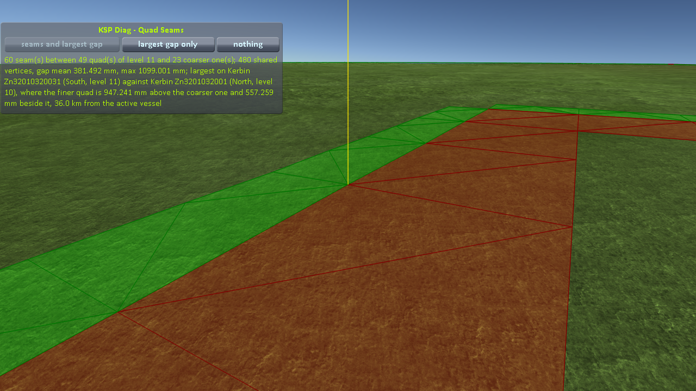
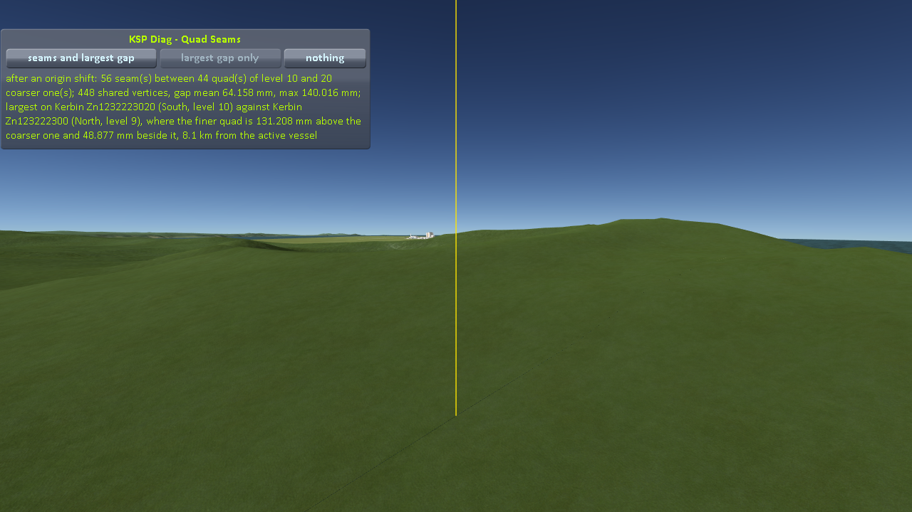
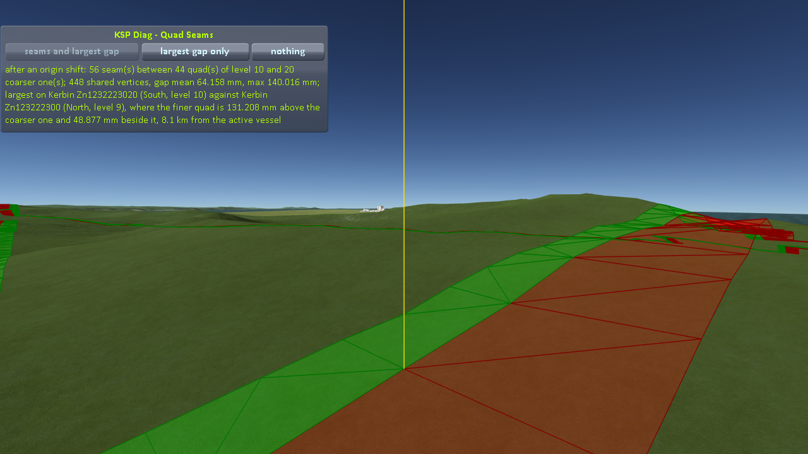

# The measurements

Part of [KSP Diag - Quad Seams](../README.md): the two cases of [the protocol](the-protocol.md),
as played so far.

Both cases were played by [the script of the protocol](the-protocol.md#played-by-a-script),
`run-revert.py`, through [KSP-MCPServer](https://github.com/lhervier/KSP-MCPServer), installed next to
this mod. The craft is `Diag3-Rocket`, a small rocket that comes with
[KSP Diag - Floating Origin](https://github.com/lhervier/KSP-Diag-FloatingOrigin/tree/master/craft).
Each table gives the last line of the log after each load, the first load being the launch itself; the
script stopped at the first load where the finer quad was above the coarser one at the largest gap, on
land, and took its two screenshots there, at the size of the window, 1280 × 720, the game's interface
hidden. The logs, what the script printed and every reading are in [the runs](../diag/README.md).

## Case 1: Real Solar System

Real Solar System 20.1.3.0 as released, with what it requires (Kopernicus 248, Modular Flight
Integrator, KSPTextureLoader, the RSS textures), on KSP 1.12.5 with Harmony, ModuleManager and KSP
Community Fixes 1.41.1; the craft on the launchpad at Cape Canaveral, launched at UT 64,800 s for
daylight, reverted to launch until a step of at least 0.5 m. On Earth the highest level is 11, and every
load ended with 60 seams between 49 quads of level 11 and 23 quads of level 10, 480 shared vertices.

In metres:

| Load | Gap, mean | Gap, max | Finer quad at the largest gap | Beside | From the craft | Largest gap |
|---:|---:|---:|---|---:|---:|---|
| 1 | 0.50 | 1.28 | 1.12 above | 0.61 | 36.7 km | under the sea |
| 2 | 1.64 | 2.40 | 2.10 below | 1.16 | 40.4 km | under the sea |
| 3 | 0.39 | 1.07 | 0.88 above | 0.60 | 37.4 km | under the sea |
| 4 | 0.31 | 1.00 | 0.85 below | 0.53 | 33.7 km | on land |
| 5 | 0.46 | 1.28 | 1.08 above | 0.69 | 37.2 km | under the sea |
| 6 | 0.68 | 1.43 | 1.23 above | 0.74 | 35.5 km | under the sea |
| 7 | 0.46 | 1.29 | 1.11 below | 0.66 | 37.7 km | under the sea |
| 8 | 0.99 | 1.88 | 1.61 below | 0.96 | 41.0 km | on land |
| 9 | 1.60 | 2.52 | 2.19 below | 1.25 | 37.2 km | under the sea |
| 10 | 0.44 | 1.26 | 1.11 below | 0.61 | 41.5 km | on land |
| 11 | 0.36 | 1.08 | 0.91 above | 0.58 | 42.1 km | under the sea |
| 12 | 1.47 | 2.13 | 1.87 below | 1.02 | 40.1 km | on land |
| 13 | 1.26 | 2.02 | 1.77 below | 0.98 | 40.9 km | under the sea |
| 14 | 0.36 | 1.08 | 0.93 above | 0.55 | 37.2 km | under the sea |
| 15 | 0.31 | 0.85 | 0.67 above | 0.53 | 39.5 km | under the sea |
| 16 | 0.34 | 1.11 | 0.97 below | 0.54 | 34.5 km | under the sea |
| 17 | 0.38 | 1.10 | 0.95 above | 0.56 | 36.0 km | on land |

**Load 17, the finer quad 0.95 m above**, the camera 37.1 km from the craft, two screenshots from the
same camera: the yellow line only, then everything.

**→ What it shows: [The seam is open](what-the-measurements-show.md#the-seam-is-open), and
[Where to look from](what-the-measurements-show.md#where-to-look-from)**

## Case 2: stock KSP

KSP 1.12.5 with Harmony, ModuleManager and KSP Community Fixes 1.41.1; the craft on the launchpad at
the Space Center, on Kerbin, launched at UT 3,600 s for daylight, reverted to launch until a step of at
least 50 mm. On Kerbin the highest level is 10, and every load ended with 56 seams between 44 quads of
level 10 and 20 quads of level 9, 448 shared vertices.

In millimetres:

| Load | Gap, mean | Gap, max | Finer quad at the largest gap | Beside | From the craft | Largest gap |
|---:|---:|---:|---|---:|---:|---|
| 1 | 45.5 | 117.7 | 115.6 below | 22.3 | 6.7 km | under the sea |
| 2 | 62.6 | 141.2 | 134.6 below | 42.7 | 6.7 km | under the sea |
| 3 | 151.3 | 237.0 | 237.0 below | 1.3 | 8.1 km | on land |
| 4 | 224.5 | 312.1 | 310.2 below | 33.9 | 7.1 km | under the sea |
| 5 | 71.1 | 156.5 | 156.0 below | 11.4 | 6.6 km | on land |
| 6 | 67.9 | 168.6 | 167.2 below | 21.1 | 6.3 km | on land |
| 7 | 64.2 | 140.0 | 131.2 above | 48.9 | 8.1 km | on land |

**Load 7, the finer quad 131 mm above**, the camera 8.4 km from the craft, two screenshots from the same
camera: the yellow line only, then everything.

**→ What it shows: [The seam is open](what-the-measurements-show.md#the-seam-is-open), and
[Where to look from](what-the-measurements-show.md#where-to-look-from)**
