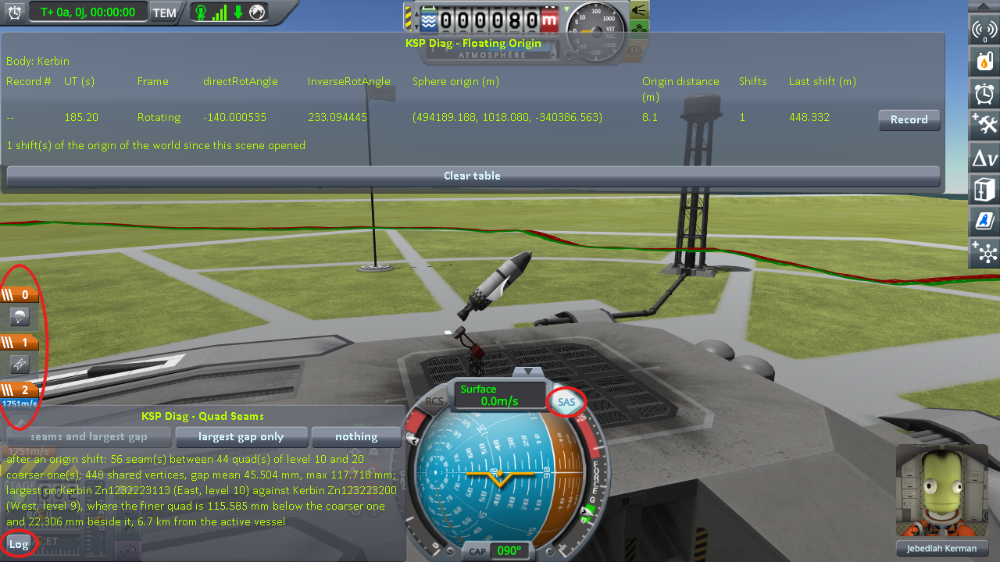
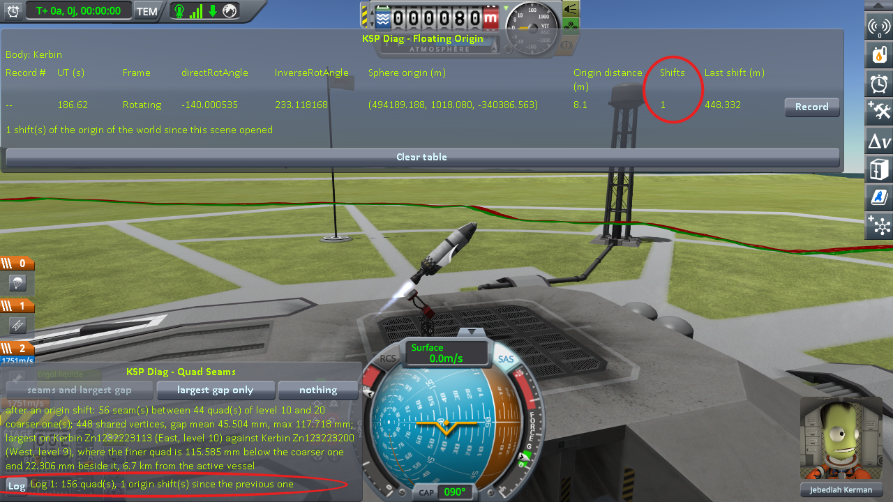
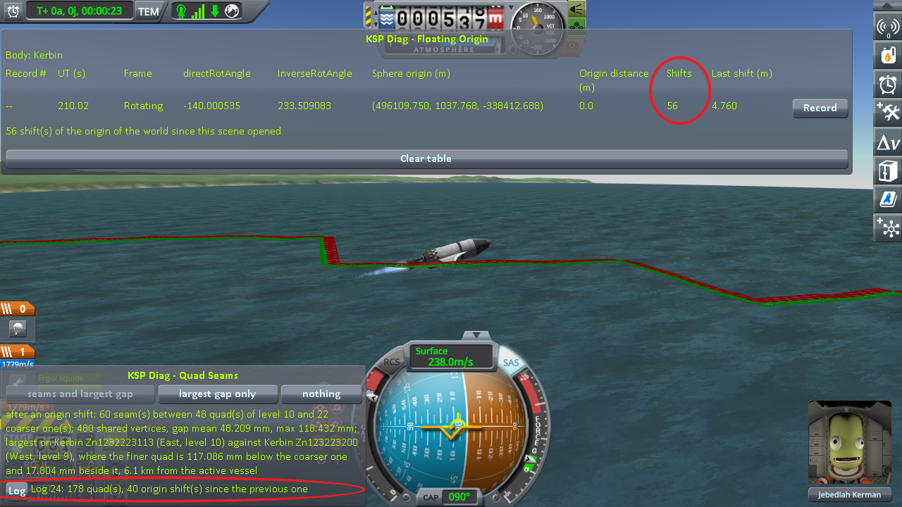
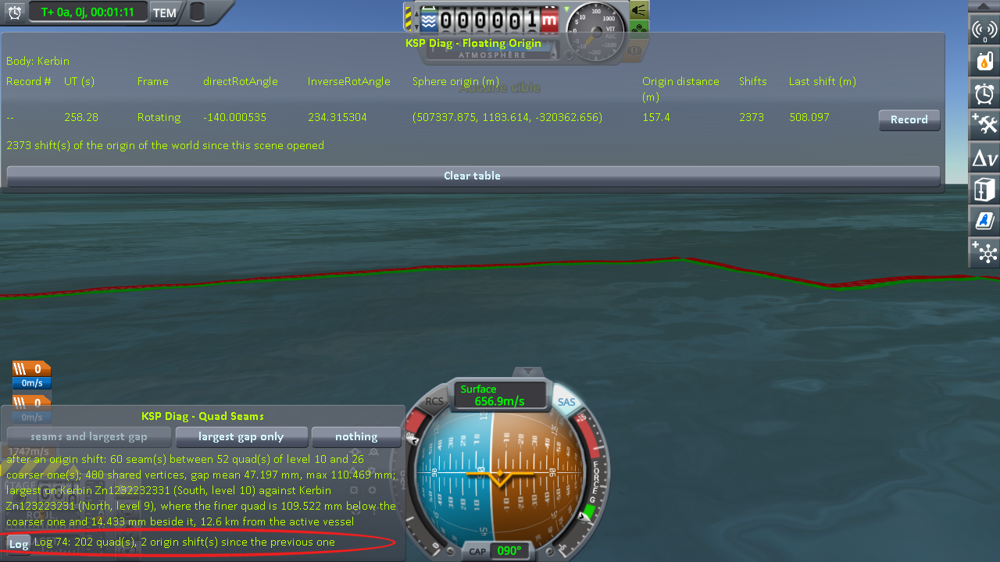

# The protocol: the quads of the highest level, in flight

Part of [KSP Diag - Quad Seams](../README.md): a rocket launched from the launchpad and left to fly until
it falls back, with a *Log* about once a second. The two files the *Log* button writes, and what their
columns hold, are in [What it shows](what-it-shows.md#the-log-button).

On the ground, the terrain under a craft is built once and stays. In flight, it is built all the time:
as the craft goes, quads of the highest level are built ahead of it and dropped behind it, while the
game moves its whole world back under the craft, every 500 m it travels, and every frame once it goes
fast. This protocol writes where every vertex of those quads is, over a whole flight, so that each quad
can be followed from one *Log* to the next, and compared with its neighbours.

## What it needs

- **This mod.**
- **[KSP Diag - Floating Origin](https://github.com/lhervier/KSP-Diag-FloatingOrigin)**, beside it, to
  watch the world move during the flight: its **Shifts** column counts the moves. The *Log* counts them
  too, in its file, so it is a help, not a need.
- **The craft**, [`Quad-Rocket`](../craft/Quad-Rocket.craft): a command pod on two fuel tanks and a
  single engine, with two fins and a parachute that is never opened, held on the launchpad by a launch
  clamp, and built leaning about 49° from the vertical, towards the east, so that it flies a low curve
  over the sea rather than straight up. Copy it into the `Ships/VAB` folder of a sandbox
  game, and launch it from the Vehicle Assembly Building onto the launchpad.

The flight is about the same at every launch, as long as nothing is touched once it has left the pad. On
Kerbin, it lasts about 70 seconds, up to about 950 m and 650 m/s, into the sea east of the Space Center.

## The steps

1. On the launchpad, open the cheats (`Alt+F12`, *Cheats*) and turn on *Infinite Propellant* and
   *Infinite Electricity*. Turn SAS on (`T`) and the throttle to full (`Z`).

   

   *KSP 1.12.5 with KSP Community Fixes, this mod and KSP Diag - Floating Origin: `Quad-Rocket` on the
   launchpad, SAS on, the throttle at full, the stages still to come on the left.*

2. Press the space bar once: the engine lights, and the launch clamp still holds the craft. Press *Log*.

   

   *The same, the first stage activated, right after the first Log: its line, under the button, and the
   Shifts column of KSP Diag - Floating Origin.*

3. Press the space bar again: the clamp lets go, and the craft lifts off.
4. From then on, touch nothing but the *Log* button: press it about once a second, by the mission clock
   at the top left of the screen, until the craft falls into the sea. A little over 200 m/s, the world
   starts moving every frame: Diag FloatingOrigin's **Shifts** column runs up, and so does the count of
   moves in the line of each *Log*.

   

   *The same flight, the first Log after which the world had moved more than once since the previous
   one.*

   

   *The same flight, the last Log, as the craft hits the sea.*

The two files are in `GameData/KSPDiagQuadSeams/PluginData/`; copy them somewhere before starting KSP
again, which starts a new pair at its first *Log*.

## Reading the two files

**In a spreadsheet.** Both files are plain text and open in Excel, or any spreadsheet: import them as
text, with `;` as the separator of columns and `.` as the decimal separator. Each line of the file of
quads is one quad at one *Log*: filtering on its name follows a quad from one *Log* to the next, and
filtering on a *Log* gives the terrain at that moment.

**With a script.** The figures of [the measurements](the-measurements-flight.md) were computed by
[`diag/automation/analyse-flight.py`](../diag/automation/analyse-flight.py), which needs nothing but
Python 3:

```
python analyse-flight.py logs-<date>.csv quads-<date>.csv
```

It prints three measures, for the quads of the highest level, in millimetres: their median, 90th
percentile and largest value.

- **The same quad, from one Log to the next.** For each quad, between two *Logs* it appears in one after
  the other, the largest change of the distance of one of its vertices to the centre of the body; split
  by the speed of the craft at the second *Log*, under or over 100 m/s.
- **The step between siblings.** Two quads of the highest level split from the same quad, at the same
  moment, share an edge: along it, their vertices should be at the same distance from the centre of the
  body. The step is how far apart they are, in the same *Log*.
- **The step between cousins.** The same, for two quads of the highest level that share an edge without
  having been split from the same quad; split in two: the pairs both written from the first *Log* on,
  built as the scene opened, and the others, of which one at least was built during the flight.

The files hold no neighbours, only names and distances. Two edges are taken as one shared edge when the
distances along them rise and fall the same way, to within 20 mm between each pair of vertices, and are
apart by the same amount all along, to within 1 mm. An edge along which the ground rises and falls by
less than a metre in all is left out: flat ground would match any other flat ground. In a spreadsheet,
the same can be done by hand for a few quads.

## Played by a script

[`diag/automation/run-flight.py`](../diag/automation/run-flight.py) plays the steps above. It drives KSP
through [KSP-MCPServer](https://github.com/lhervier/KSP-MCPServer), a mod that answers requests sent to
it over HTTP, from the computer KSP runs on only; and it needs nothing but Python 3 — no AI, no package
to install. Anyone can read it top to bottom: it follows the steps above in the same order.

1. Install KSP-MCPServer next to this mod, copy [`Quad-Rocket.craft`](../craft/Quad-Rocket.craft) into
   the `Ships/VAB` folder of a sandbox game, start KSP and wait for the main menu.
2. Run `python run-flight.py --folder <your sandbox game> --craft VAB/Quad-Rocket.craft --out flight --quit`.

It opens the game, launches the craft onto the launchpad, turns on both cheats, turns SAS on and the
throttle to full, activates the first stage, waits a second, takes the first *Log*, and activates the
second stage. It then takes a *Log* every second, on a clock of its own, until the craft is no longer
flying: destroyed, landed or in the sea. It copies the two files into `--out`, with `readings.json`,
what each *Log* answered, and quits KSP with `--quit`. With `--screenshots`, and Diag FloatingOrigin
installed, it also takes the four screenshots above. Save `KSP.log` before starting KSP again: KSP
writes it anew at every start.
