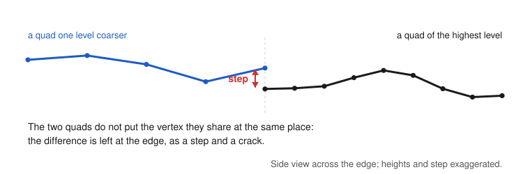
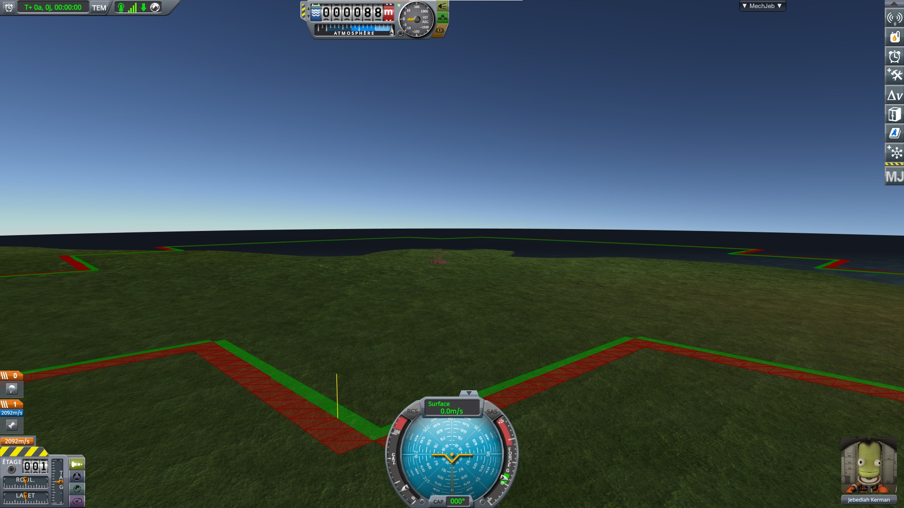

# What it shows

Part of [KSP Diag - Quad Seams](../README.md): the seam between two subdivision levels, what the
mod draws over it, and what it writes to the log.

## The seam

The terrain of a body is made of square patches, the quads, split into four smaller ones as the craft
gets closer. Around the active craft, the quads are split down to the highest level the body allows;
further away, they are coarser.

Every quad has the same grid of vertices, 15 by 15 in stock. A quad one level coarser covers twice the
width, so along the edge they share, the finer quad has twice as many vertices: every other one has no
counterpart on the coarser edge, and would leave a crack.

The game does not move those vertices. It changes the triangles of the finer quad along that edge:
`PQ.GetEdgeState` marks each side whose neighbour has a lower subdivision level, and the quad takes one
of sixteen precomputed lists of triangles, one per combination of marked sides (`PQS.cacheIndices`).
Along a marked side, each pair of cells gets three triangles instead of four, and the vertex between
them is left out of all of them:


The finer edge then runs along the same segments as the coarser one — provided the vertices both quads
share land on the same point. The triangles this mod draws are these ones, along the edges of both
quads.

They do not always land on the same point, even in stock. Where they do not, the edge of the finer
quad runs a little above or below the edge of the coarser one, and nothing joins the two: the terrain
has a step, and a crack along the seam.

This comes from the way the game places each vertex: through the matrix of the terrain sphere, whose
position and rotation are held in float numbers, far from the origin of the world. That matrix changes
when the origin of the world moves, or when the sphere turns; two quads built before and after such a
change do not round the vertex they share the same way. That matrix keeps changing, at every load and
during a flight, and is never put back where it was:
[KSP Diag - Floating Origin](https://github.com/lhervier/KSP-Diag-FloatingOrigin) records it
([What the measurements show](https://github.com/lhervier/KSP-Diag-FloatingOrigin/blob/master/docs/what-the-measurements-show.md)).



How far apart they are, load after load, is in [The measurements](the-measurements.md).

The quads of the highest level follow the active craft: as it moves, the quads ahead of it are split
and the ones far behind it are merged back. The seam therefore stays about the same distance from the
craft whatever it does, and a craft cannot be driven up to it.

Why the two edges may not meet, and what that has to do with the precision of the terrain, is explained
by [Terrain Precision Fix](https://github.com/lhervier/KSP-TerrainPrecisionFix), in
[The seam between subdivision levels](https://github.com/lhervier/KSP-TerrainPrecisionFix/blob/master/docs/limits-and-solutions/the-seam-between-subdivision-levels.md).

## The drawing

For every side where a quad of the highest level lies against a coarser quad, the mod draws, over the
terrain:

- **in green**, the triangles the finer quad has along that side, as the game draws them at that moment;
- **in red**, the triangles the coarser quad has along the side that faces it;
- **a yellow vertical line**, 1 km tall, rising from the shared vertex where the two quads are furthest
  apart: the one the log talks about.

Each triangle is filled, see-through, and outlined in a darker shade of the same colour, one pixel wide.
The drawing ignores the depth of the terrain: it stays visible behind a hill, and every vertex is drawn
where the game puts it, not lifted towards the camera. The edges between two quads of the highest level
are not drawn, and nothing is drawn while no quad of the highest level is shown, high above the ground
for instance.

<p>


</p>

*Left: stock KSP 1.12.5 with KSP Community Fixes, a capsule landed a few kilometres from the Space
Center, the camera pulled back 10 km from it. Right: Real Solar System as released on KSP 1.12.5, with
KSP Community Fixes, a craft on the launchpad at Cape Canaveral, the camera pulled back beyond the edge
of the zone of the highest level and looking back towards the craft.*

**Three buttons** in the mod's window choose the mode: everything, the yellow line only, nothing. The
triangles cover the ground they are drawn on; the yellow line alone shows where to look while leaving the
ground itself in sight. The button of the mode in force is greyed out, and the window also shows the last
line of log; `Alt+F6` hides the window. The choice is kept across scene changes and reloads, and measuring
and logging go on whatever it is.

## The log

Each time the seams change, and at most once a second, `KSP.log` gets a line of this form, prefixed with
`[Diag-QuadSeams]`:

```
<n> seam(s) between <n> quad(s) of level <level> and <n> coarser one(s); <n> shared vertices, gap mean <gap> mm, max <gap> mm; largest on <quad> (<side>, level <level>) against <quad> (<side>, level <level>), where the finer quad is <gap> mm above|below the coarser one and <gap> mm beside it, <distance> km from the active vessel
```

- **Shared vertices**: along a side it has changed, the finer quad keeps one vertex in two, and each of
  them should land on a vertex of the coarser quad. The mod pairs each one with the nearest vertex of
  the coarser side.
- **Gap**: the distance between the two vertices of a pair, averaged over all pairs, and the largest
  one. Both vertices are taken through the matrix their quad is drawn with, and the distance is computed
  in double precision: it is the distance between the two places the game puts them.
- **Largest on**: the two quads and sides of the largest gap; the yellow line rises from its vertex.
- **Above, below, beside**: that largest gap split along the vertical of the body at the vertex. The
  vertical part is a step in the ground; the part beside it is a crack or an overlap, which hardly shows
  from above.
- **Distance**: how far that vertex is from the active vessel.
- **Vertices with no counterpart**, when there are any: a vertex of the finer side further than a
  quarter of the coarser side's spacing from every vertex of it. This should never appear; if it does,
  the mod has misread the grid, and its gaps should not be trusted.

A line is also written right after every shift of the origin of the world, whatever it shows, prefixed
with `after an origin shift:`, and one each time a button changes the mode.

The first lines of a flight say which shader the drawing got (`Hidden/Internal-Colored`, and whether its
depth test could be turned off), then the body, its radius, its highest subdivision level and the number
of vertices along a side of a quad.
